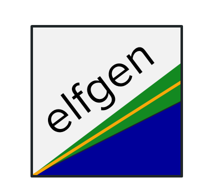
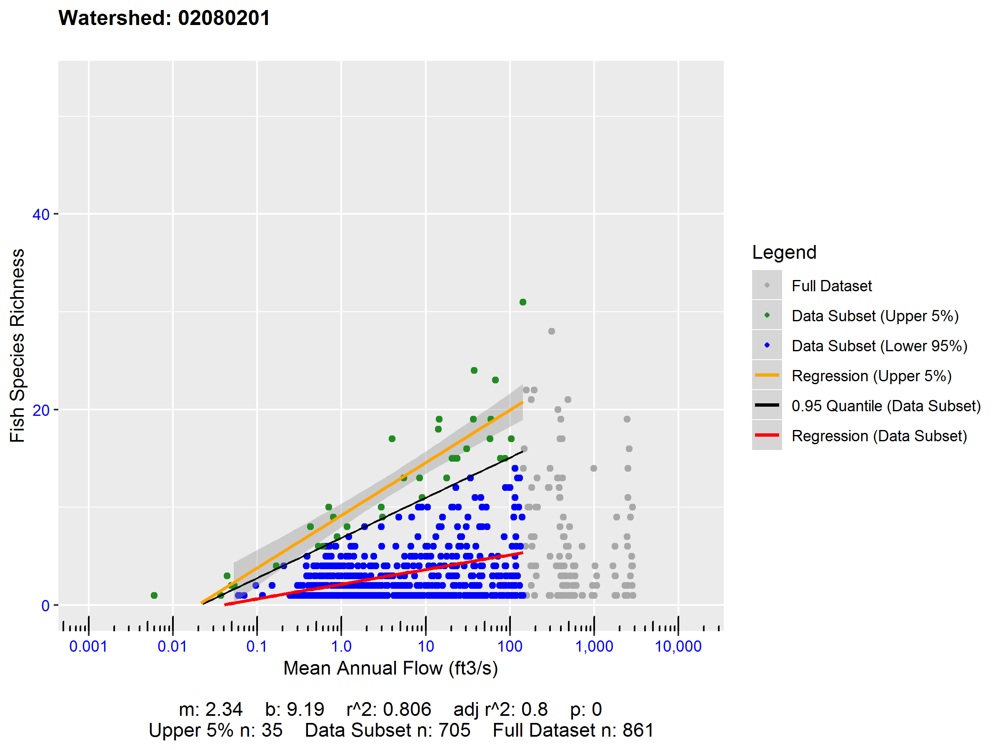
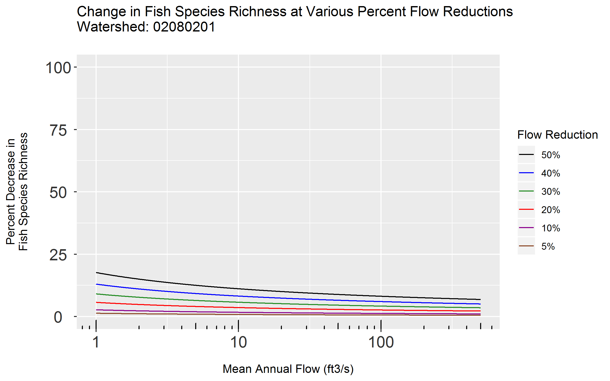

# elfgen 

[](https://travis-ci.org/HARPgroup/elfgen)
[](https://codecov.io/gh/HARPgroup/elfgen)

# Overview
 
elfgen is an instream flow framework for rapid generation and optimization of flow-ecology relations. The elfgen framework centers on the generation of ecological limit function models (ELFs) describing the relation between maximum species richness and stream size (streamflow or drainage area). Supporting manuscript is currently under development.

# Installation

``` r
# Install development version from Github:
# install.packages("devtools")
devtools::install_github("HARPgroup/elfgen")
```

# Usage
An introductory example of how elfgen works is supplied below. You start 
by either supplying a dataset with flow and richness data, or by supplying 
a HUC code of interest. When supplying a HUC code: `elfdata()` will 
retieve IchthyMaps data from USGS ScienceBase and automatically derive fish 
species richness at the NHDPlusV2 segment scale. Mean annual flow data is then
automatically retrieved for each NHDPlusV2 segment using an EPA JSON webservice.

A breakpoint in the flow-ecology relation is determined using a fixed user-defined
value, or identified using the functions `bkpt_pwit()` or `bkpt_ymax()`. The ELF
model is then generated and plotted using `elfgen()` with ELF model statistics
returned.

Additional richness change analyses may be performed using the functions `richness_change()` and `elfchange()` (See below)


## Example
### Load package and data.

``` r
library(elfgen)

# Retrieve dataset of interest
# You may enter either a 6, 8, 10, or 12-digit HUC code
watershed.df <- elfdata('02080201')
```

``` r
# Alternatively, utilize a user-supplied dataset in the following format:
watershed.df <- data.frame(flow=c(28.257, 20.254, 22.825, ...), 
			   richness=c(2, 10, 12, ...),
			   watershed='02080201',
			   stringsAsFactors=FALSE) 
```

``` r
# If multiple richness values are present for a single flow value, 
# you can aggregate to the maximum richness value with the following:
watershed.df <- aggmax(watershed.df)			   
```


### Identify breakpoint in flow-ecology relation using one of 3 methods.
* **Fixed Method**: This approach utilizes a user specified breakpoint value. This "fixed breakpoint" is typically 
	determined through visual inspection of the flow-ecology relation by the user.
* **Piecewise Iterative Method**: This approach uses an iterative algorithm to identify shifts in the relation between maximum richness 
	and stream size. A user specifies a quantile for isolating an upper subset of the data. A user also 
	identifies a bounding range between two x-values (“bound low” = blo, “bound high” = bhi) in which the 
	upper subest of data is believed to contain a breakpoint.
* **Ymax Method**: This approach treats the maximum observed species richness value as the breakpoint. This function begins 
	by locating the point with the highest y-value in the full dataset, then utilizing the associated x-value 
	as the breakpoint.

``` r
# Fixed Method
breakpt <- 500

# Piecewise Iterative Method
breakpt <- bkpt_pwit("watershed.df" = watershed.df, "quantile" = 0.95, "blo" = 200, "bhi" = 500)  
#> [1] "Breakpoint identified at 310.815"
		
# Ymax Method		
breakpt <- bkpt_ymax("watershed.df" = watershed.df)			   
#> [1] "Breakpoint identified at 142.989"
```

### Plot flow-ecology relation and generate ELF model.	
* A user specifies a `quantile` for isolating the upper subset of the data. The breakpoint `breakpt` determined using one of the  
	above methods is passed in. `yaxis_thresh` is used to customize the maximum y-axis limit. x-axis and y-axis plot labels can 
	be specified using `xlabel` and `ylabel` respectively.

	
``` r				   
elf <- elfgen("watershed.df" = watershed.df,
	      "quantile" = 0.95,
	      "breakpt" = breakpt,
	      "yaxis_thresh" = 53, 
	      "xlabel" = "Mean Annual Flow (ft3/s)",
	      "ylabel" = "Fish Species Richness")
```

``` r
elf$plot
```

<!-- -->

``` r
elf$stats
#>     watershed breakpt quantile    m    b rsquared rsquared_adj p n_total n_subset n_subset_upper
#> 1	02080201 142.989     0.95 2.34 9.19    0.806          0.8 0     861      705             35
```

## Richness Change

``` r
# Calculate absolute richness change
richness_change(elf$stats, "pctchg" = 10)
#> [1] "Absolute Richness Change:"
#> [1] 0.2465436

# Calculate percent richness change at a specific stream size
richness_change(elf$stats, "pctchg" = 10, "xval" = 500)
#> [1] "Percent Richness Change at x = 500:"
#> [1] 1.038858
```

``` r
# Generate plot of percent richness change for various percent flow reductions
elfchange(elf$stats, "yaxis_thresh" = 25)
```

<!-- -->
