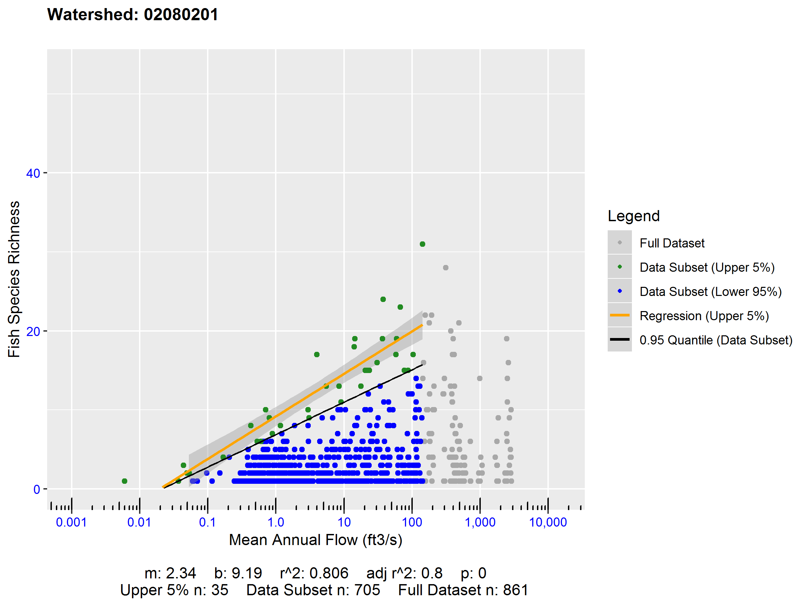

# elfgen 

## Overview

elfgen is a framwework for generating Ecological Limit Functions (ELFs).

## Installation

``` r
library("devtools")
install_github('HARPgroup/elfgen')
library(elfgen)
```

## Usage
An introductory example of how elfgen works is supplied below. You start 
by either supplying a dataset with flow and richness data, or by supplying 
a HUC code of interest. When supplying a HUC code: elfgen_getdata() will 
retieve IchthyMaps data from USGS ScienceBase and automatically derive fish 
species richness at the NHDPlusV2 segment scale. Mean annual flow data is then
automatically retrieved for each NHDPlusV2 segment using an EPA JSON webservice.

``` r
library(elfgen)

# Retrieve dataset of interest
watershed.df <- elfgen_getdata('02080201')

# Determine breakpoint in flow-ecology relation
breakpt <- method_pwit("watershed.df" = watershed.df, "quantile" = 0.95, "glo" = 50, "ghi" = 1000)  
					   
# Plot the flow-ecology relation and derived ELF model					   
elfgen_baseplot("watershed.df" = watershed.df,
                "quantile" = 0.95,
                "breakpt" = breakpt,
                "yaxis_thresh" = 53,
                "xlabel" = "Mean Annual Flow (ft3/s)",
                "ylabel" = "Fish Species Richness")
```

<!-- -->
