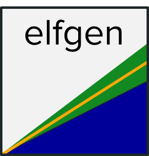

# elfgen 

## Overview

elfgen is a framwework for generating Ecological Limit Functions (ELFs).

## Installation

``` r
library("devtools")
install_github('HARPgroup/elfgen')
library(elfgen)
```
# Usage
```
elfgen_cleandata(data=data.frame())

watershed.df <- elfgen_getdata('020700080403')
elfgen_testplot(watershed.df)
```
