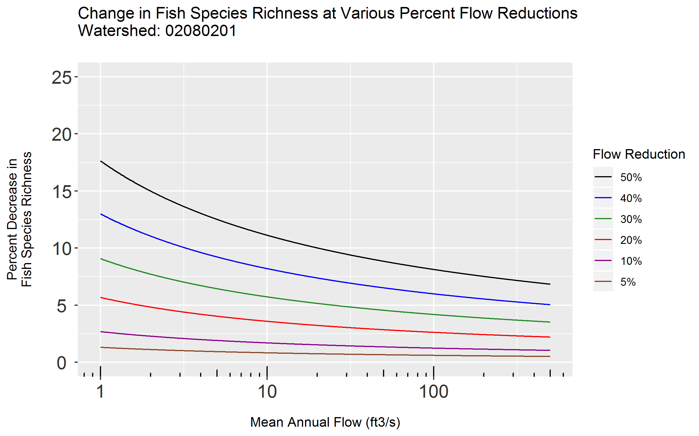

# elfgen 

[](https://travis-ci.org/HARPgroup/elfgen)
[](https://codecov.io/gh/HARPgroup/elfgen)

# Overview
 
elfgen is a framework for generating Ecological Limit Function (ELF) models.

# Installation

``` r
# Install development version from Github:
# install.packages("devtools")
devtools::install_github("HARPgroup/elfgen")
```

# Usage
An introductory example of how elfgen works is supplied below. You start 
by either supplying a dataset with flow and richness data, or by supplying 
a HUC code of interest. When supplying a HUC code: `elfgen_getdata()` will 
retieve IchthyMaps data from USGS ScienceBase and automatically derive fish 
species richness at the NHDPlusV2 segment scale. Mean annual flow data is then
automatically retrieved for each NHDPlusV2 segment using an EPA JSON webservice.

A breakpoint in the flow-ecology relation is determined using a fixed user-defined
value, or identified using the functions `bkpt_pwit()` or `bkpt_ymax()`. The ELF
model is then generated and plotted using `elfgen()` with ELF model statistics
returned.

``` r
library(elfgen)

# Retrieve dataset of interest
watershed.df <- elfgen_getdata('02080201')

# Determine breakpoint in flow-ecology relation
breakpt <- bkpt_pwit("watershed.df" = watershed.df, "quantile" = 0.95, "glo" = 50, "ghi" = 1000)  
#> [1] "Breakpoint identified at 142.989"
			   
# Plot the flow-ecology relation and generate ELF model					   
elf <- elfgen("watershed.df" = watershed.df,
	      "quantile" = 0.95,
	      "breakpt" = breakpt,
	      "yaxis_thresh" = 53,
	      "xlabel" = "Mean Annual Flow (ft3/s)",
	      "ylabel" = "Fish Species Richness")
```

``` r
elf$plot
```

<!-- -->

``` r
elf$stats
#>	   m    b rsquared rsquared_adj p n_total n_subset n_subset_upper
#> 1	2.34 9.19    0.806          0.8 0     861      705             35
```

# Richness Change

``` r
# Calculate absolute richness change
richness_change(elf$stats, "pctchg" = 10)
#> [1] 0.2465436

# Calculate percent richness change at a specific stream size
richness_change(elf$stats, "pctchg" = 10, "xval" = 500)
#> [1] 1.038858
```

``` r
# Generate plot of percent richness change for various percent flow reductions
elfchg(elf$stats, "yaxis_thresh" = 25)
```

<!-- -->
